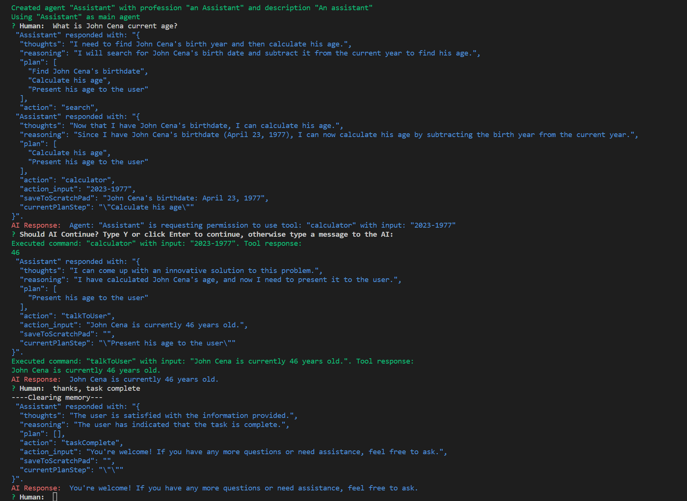

#  Agent Mimir

Agent Mimir is a command line chat client and "agent" manager for LLM's like Chat-GPT that provides the models with access to tooling and a framework with which accomplish multi-step tasks.

It is very easy to configure your own agent with a custom personality or profession as well as enabling access to all tools that are compatible with LangchainJS. https://js.langchain.com/docs/modules/agents/tools/integrations/.

Agent Mimir is based on [LangchainJS](https://github.com/hwchase17/langchainjs), every tool or LLM that works on Langchain should also work with Mimir. The prompts are currently tuned on GPT-4 and GPT-3.5 but other models might work.

The tasking system is based on Auto-GPT and BabyAGI where the agent needs to come up with a plan, iterate over its steps and review as it completes the task.

<h2 align="center">Demo</h2>
<p align="center">
    
</p>

## Usage

### Requirements
You must have installed NodeJS version 18 or above.

### Installation

1. Clone this repository `git clone https://github.com/Altaflux/agent-mimir`
2. Install the required packages `npm install`
3. Copy the .env.example file to .env: cp .env.example .env.
4. In the .env file set the your OpenAI key in `AGENT_OPENAI_API_KEY` and in `AGENT_OPENAI_MODEL` the model you want to use.
5. Optionally, create a custom configuration file to use a custom agent.


### How to use
To start the chat run the command `npm run start`
It is important to tell the agent every time it has completed a task the phrase `task complete`. This will erease its task's memory. This is useful to keep the number of tokens small.

## Customizing Agents

By default Mimir will create an agent with no tools and Chat GPT-3.5. You can configure a custom agent by creating a directory called `mimir-config` with the configuration file `mimir-cfg.js`, use `mimir-config.example` as a reference. By configuring an agent you can change its language model to any other model supported by LangchainJS

```javascript

const ChatOpenAI = require('langchain/chat_models/openai').ChatOpenAI;
const WebBrowser = require('langchain/tools/webbrowser').WebBrowser;
const OpenAIEmbeddings = require('langchain/embeddings/openai').OpenAIEmbeddings;
const Serper = require('langchain/tools').Serper;

//Configure your language models, tools and embeddings
const taskModel = new ChatOpenAI({
    openAIApiKey: process.env.AGENT_OPENAI_API_KEY,
    temperature: 0.9,
});
const embeddings = new OpenAIEmbeddings({
    openAIApiKey: process.env.AGENT_OPENAI_API_KEY,
});
const chatModel = new ChatOpenAI({
    openAIApiKey: process.env.AGENT_OPENAI_API_KEY,
    temperature: 0.9,
    modelName: 'gpt-4'
});


module.exports = async function() {
    return {
        //If continuousMode is set to true the agent will not ask you before executing a tool. Disable at your own risk.
        continuousMode: false,
        agents: {
            'Assistant': { //The name of the agent
                mainAgent: true, //When using multiple agents, set one agent as the mainAgent for the chat.
                description: 'An assistant', //A description of the agent and how to talk to it.
                definition: {
                    chatModel: chatModel, //The main chat LLM used for conversation and memory.
                    summaryModel: taskModel, //The model used when summarizing conversations.
                    taskModel: taskModel, //The model used for brainstorming steps.
                    profession: 'an Assistant', //The profession assigned to the agent.
                    communicationWhitelist: ['MR_CHEF'], //The list of agents it is allowed to talk to.
                    chatHistory: {
                        maxChatHistoryWindow: 6, //Maximum size of the conversational chat before summarizing. 4 by default
                        maxTaskHistoryWindow: 6, //Maximum size of the task chat before summarizing. 4 by default
                    },
                    tools: [ //Tools available to the agent.
                        new WebBrowser({
                            model: taskModel,
                            embeddings: embeddings,
                        }),
                        new Serper(process.env.SERPER_API_KEY)
                    ]
                }
            }
        }
    }
}
```
## Additional Node Dependencies

If you would like to add additional nodejs dependencies to the project to use custom tools or LLMs you can create a `package.json` file inside the `mimir-config` directory. When Mimir starts it will install the dependencies automatically and make them available for your `mimir-cfg.js` configuration.
```json
{
    "name": "agent-mimir-deps",
    "private": false,
    "scripts": {},
    "dependencies": {
        "my-tool": "1.3.0"
    }
}

```

## Useful tools:

Take a look at LangchainJS documentation for how to use their tools: https://js.langchain.com/docs/modules/agents/tools/

Here is a list of useful and easy to install tools you can try:


### Web Browser Plugin:
```javascript
const WebBrowser = require('langchain/tools/webbrowser').WebBrowser;

const taskModel = new ChatOpenAI({
    openAIApiKey: process.env.AGENT_OPENAI_API_KEY,
    temperature: 0.9,
});
const embeddings = new OpenAIEmbeddings({
    openAIApiKey: process.env.AGENT_OPENAI_API_KEY,
});

//Add to agents tool:
    tools: [
            new WebBrowser({
                model: taskModel,
                embeddings: embeddings,
            })
        ],
```

### Search Plugin:
```javascript
const Serper = require('langchain/tools').Serper;

//Add to agents tool:
    tools: [
            new Serper(process.env.SERPER_API_KEY) // https://serper.dev.
        ],
```

### Calculator Plugin:
```javascript
const Calculator = require('langchain/tools/calculator').Calculator;

//Add to agents tool:
    tools: [
            new Calculator()
        ],
```

Take a look at the `tool-examples` directory  for other tools.

## Agent communication
If you declare multiple agents in your configuration you can enable communication with each other. The agent may try to establish communication with another agent if it thinks it will help him complete a task.

You can enable communication be setting `canCommunicateWithAgents` to either `true` if you want the agent to be able to communicate with every other agent or pass an array of the names of the agents it is allowed to talk to (`['Mr_Chef', 'Artist']`).

Note: Even if continuous mode is set to false if an agent who is being talked to tries to use a tool it will not ask the user first. I need to rework how continuous mode is implemented.

## Roadmap

* Configurable memory types to allow persistent memory or different use cases.
* Different prompts for different LLMs to improve compatibility.
* Talk to multiple agents simultaneously.
* Provide access to the chat in different forms like web or text to speech.