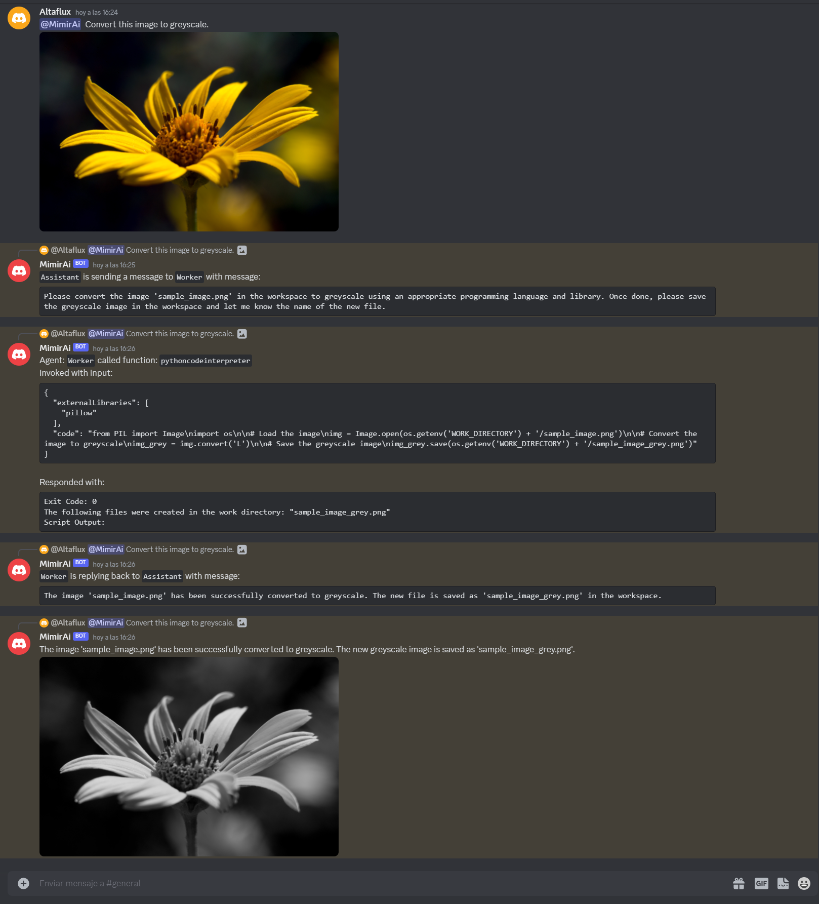
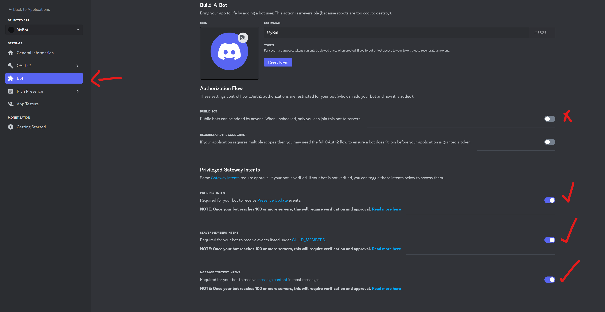

#  Agent Mimir

Agent Mimir is a command line and Discord chat client "agent" manager for LLM's like Chat-GPT that provides the models with access to tooling and a framework with which accomplish multi-step tasks.

It is very easy to configure your own agent with a custom personality or profession as well as enabling access to all tools that are compatible with LangchainJS. https://js.langchain.com/docs/modules/agents/tools/integrations/.

Agent Mimir is based on [LangchainJS](https://github.com/hwchase17/langchainjs), every tool or LLM that works on Langchain should also work with Mimir. The prompts are currently tuned on GPT-4 and GPT-3.5 but other models might work.

The tasking system is based on Auto-GPT and BabyAGI where the agent needs to come up with a plan, iterate over its steps and review as it completes the task.

<h2 align="center">Discord Demo</h2>
<p align="center">
    
</p>

## Usage

### Requirements
You must have installed NodeJS version 18 or above.

### Installation

1. Clone this repository `git clone https://github.com/Altaflux/agent-mimir`
2. Install the required packages `npm install`
3. Copy the .env.example file to .env: cp .env.example .env.
4. In the .env file set the your OpenAI key in `OPENAI_API_KEY`.
5. Optionally, create a custom configuration file to use a custom agent.


## How to use

### Discord Client

#### Discord Bot Setup
To use Mimir as a Discord bot you first need to create a Bot on the developer's portal: [Discord Developer Portal](https://discord.com/developers/applications/).


Click on `New Application` and give a name to your Bot.
<p align="center">
    
</p>

Disable `Public Bot` if you do not wish to allow others to join the bot into servers.

Enable `PRESENCE INTENT`, `SERVER MEMBERS INTENT`, and `MESSAGE CONTENT INTENT`.

<p align="center">
    
</p>

Click on `Reset Token` to generate the Discord Bot token, this token needs to be saved in your `.env` file as `DISCORD_TOKEN`. 

Under the `Oauth2` tab go into the `URL Generator`, select the `bot` scope and the `Send Messages` permissions. At the bottom of the page copy the generated URL and open it in a browser. This link will allow you to register the bot in your discord server.

<p align="center">
    
</p>

#### Discord Bot Usage
To start the chat run the command `npm run start-discord`
When talking to the bot inside a server you have to Direct Mention him or else he will not respond. If you are talking to the bot directly outside of a server then there is not need to mention him.
```
@BotName Hey assisant, how are you doing?
```
You can send files to the agent by simply attaching them in your message.

To reset the agent back to its initial state use the Discord command `/reset`. This command will clear all the chat history and workspace of all agents.

### Command Line Client

The command line version can be started by running the command `npm run start-cli`.

### Files
To send files to the agent you can pass the file paths inside `()` at the beginning of your message.

```
(C:\Users\user\Pictures\image1.jpg)(C:\Users\user\Pictures\image2.jpg) Convert this images to greyscale.
```
The agent will respond back with the path of files it may have produced.

### Commands
Currently only a `/reset` command is supported. This command will resent the agents to their initial state.

## Customizing Agents Configuration

By default Mimir will create an agent with no tools and Chat GPT-4. You can configure a custom agent by creating a directory called `mimir-config` with the configuration file `mimir-cfg.js`, use `mimir-config.example` as a reference. By configuring an agent you can change its language model to any other model supported by LangchainJS

```javascript

const ChatOpenAI = require('langchain/chat_models/openai').ChatOpenAI;
const OpenAIEmbeddings = require('langchain/embeddings/openai').OpenAIEmbeddings;

//Configure your language models, tools and embeddings
const summaryModel = new ChatOpenAI({
    openAIApiKey: process.env.OPENAI_API_KEY,
    temperature: 0.0,
    modelName: 'gpt-3.5-turbo-16k-0613',
});
const embeddings = new OpenAIEmbeddings({
    openAIApiKey: process.env.OPENAI_API_KEY,
});
const chatModel = new ChatOpenAI({
    openAIApiKey: process.env.OPENAI_API_KEY,
    temperature: 0.0,
    modelName: 'gpt-4-0613'
});


module.exports = async function() {
    
    //Plugins and tools can be loaded as follows:
    const Serper = (await import('@agent-mimir/serper-search')).Serper;
    const CodeInterpreterPluginFactory = (await import('@agent-mimir/code-interpreter')).CodeInterpreterPluginFactory;
    const WebBrowserPluginFactory = (await import('@agent-mimir/selenium-browser')).WebBrowserPluginFactory;

    return {
        //If continuousMode is set to true the agent will not ask you before executing a tool. Disable at your own risk. (Only works on cli mode for now).
        continuousMode: false,
        agents: {
            'Assistant': { //The name of the agent
                mainAgent: true, //When using multiple agents, set one agent as the mainAgent for the chat.
                description: 'An assistant', //A description of the agent and how to talk to it.
                definition: {
                    chatModel: chatModel, //The main chat LLM used for conversation and memory.
                    agentType: 'openai-function-agent', //Use "plain-text-agent" for general LLM, you can use "openai-function-agent" if your chat model is gpt-4-0613 or gpt-3.5-turbo-0613 for improved reliability. 
                    profession: 'an Assistant', //The profession assigned to the agent.
                    communicationWhitelist: ['MR_CHEF'], //The list of agents it is allowed to talk to.
                    chatHistory: {
                        summaryModel: summaryModel, //The model used when summarizing conversations. This model should preferably be able to handle double the token limit of the chat history.
                        tokenLimit: 4000, //Maximum number of tokens that can be used by the chat. 4000 by default.
                        conversationTokenThreshold: 75, //Percentage of chat history messages to summarize. Setting this to a value lower than 100% helps the agent keep better context of newer parts of the conversation.
                    },
                    plugins: [
                            new CodeInterpreterPluginFactory(),
                            new WebBrowserPluginFactory({ browserConfig: { browserName: "chrome" } }, model, embeddings),
                    ],
                    tools: [ //Tools available to the agent.
                        new Serper(process.env.SERPER_API_KEY)
                    ]
                }
            }
        }
    }
}
```
## Additional Node Dependencies

If you would like to add additional nodejs dependencies to the project to use custom tools or LLMs you can create a `package.json` file inside the `mimir-config` directory. When Mimir starts it will install the dependencies automatically and make them available for your `mimir-cfg.js` configuration.
```json
{
    "name": "agent-mimir-deps",
    "private": false,
    "scripts": {},
    "dependencies": {
        "my-tool": "1.3.0"
    }
}

```

## Useful tools:

Take a look at LangchainJS documentation for how to use their tools: https://js.langchain.com/docs/modules/agents/tools/

Here is a list of useful and easy to install tools you can try:

### Code Interpreter Plugin:
The Code Interpreter plugin allows the agent to run Python 3 scripts directly in your machine. The interpreter can access resources inside your computer. The interpreter will automatically install any dependencies the script requires to run.

`package.json`
```json
{
    "name": "agent-mimir-deps",
    "private": false,
    "scripts": {},
    "dependencies": {
        "@agent-mimir/code-interpreter": "*"
    }
}
```
`mimir-cfg.js`
```javascript

    const model = new ChatOpenAI({
        openAIApiKey: process.env.OPENAI_API_KEY,
        temperature: 0.0,
    });
    const embeddings = new OpenAIEmbeddings({
        openAIApiKey: process.env.OPENAI_API_KEY,
    });

    module.exports = async function() {
        const CodeInterpreterPluginFactory = (await import('@agent-mimir/code-interpreter')).CodeInterpreterPluginFactory;
        //...
        //Add to plugins:
        plugins: [
                new CodeInterpreterPluginFactory(),
            ],
    }
```

### Web Browser Toolset:
The Web Browser plugin allows the agent to fully navigate thru any website, giving it the ability to read and interact with the website.

`package.json`
```json
{
    "name": "agent-mimir-deps",
    "private": false,
    "scripts": {},
    "dependencies": {
        "@agent-mimir/selenium-browser": "*"
    }
}
```
`mimir-cfg.js`
```javascript
    
    const model = new ChatOpenAI({
        openAIApiKey: process.env.OPENAI_API_KEY,
        temperature: 0.0,
    });
    const embeddings = new OpenAIEmbeddings({
        openAIApiKey: process.env.OPENAI_API_KEY,
    });

    module.exports = async function() {
        const WebBrowserPluginFactory = (await import('@agent-mimir/selenium-browser')).WebBrowserPluginFactory;
        //Add to plugins:
        plugins: [
                new WebBrowserPluginFactory({ browserConfig: { browserName: "chrome" } }, model, embeddings),
            ],
    }
```

### Search Plugin:

`mimir-cfg.js`
```javascript
    module.exports = async function() {
        const Serper = (await import('@agent-mimir/serper-search')).Serper;
        //...
        tools: [
                new Serper(process.env.SERPER_API_KEY) // https://serper.dev.
            ],
    }
```

### Calculator Plugin:

`mimir-cfg.js`
```javascript
    module.exports = async function() {
        const Calculator = (await import('langchain/tools/calculator')).Calculator;
        //...
        tools: [
                new Calculator()
            ],
    }
```

Take a look at the `tool-examples` directory  for other tools.

## Agent communication
If you declare multiple agents in your configuration you can enable communication with each other. The agent may try to establish communication with another agent if it thinks it will help him complete a task.

You can enable communication be setting `canCommunicateWithAgents` to either `true` if you want the agent to be able to communicate with every other agent or pass an array of the names of the agents it is allowed to talk to (`['Mr_Chef', 'Artist']`).

## Roadmap

* Configurable memory types to allow persistent memory or different use cases.
* Different prompts for different LLMs to improve compatibility.
* Talk to multiple agents simultaneously.
* Provide access to the chat in different forms like web or text to speech.